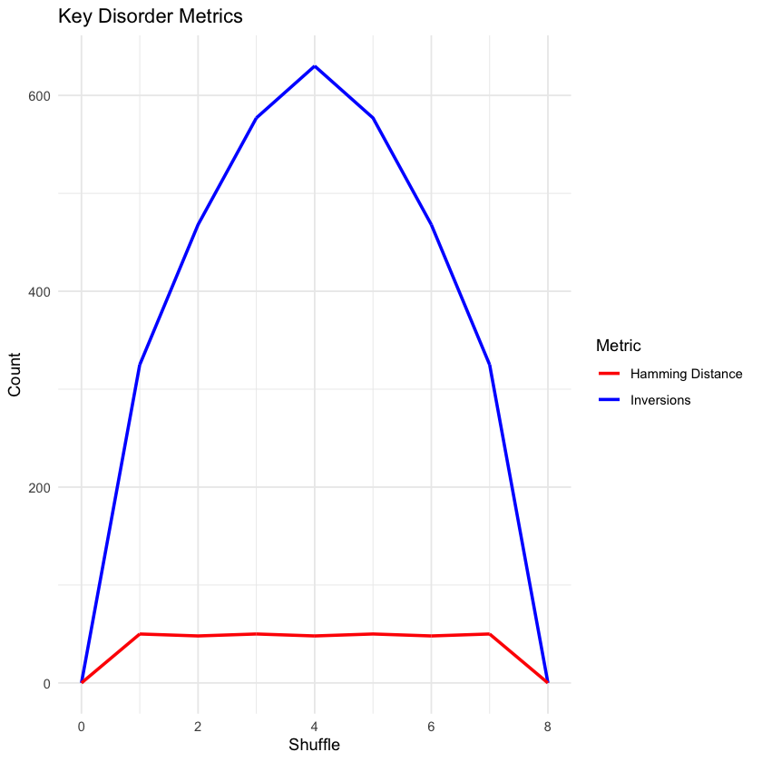

```R
library(ggplot2)
library(dplyr)
library(knitr)
library(tidyr)

set.seed(123)  # For reproducibility

# Pharaoh's shuffle function
pharaoh_shuffle <- function(deck) {
  n <- length(deck) %/% 2
  shuffled <- numeric(length(deck))
  shuffled[seq(1, length(deck), 2)] <- deck[1:n]
  shuffled[seq(2, length(deck), 2)] <- deck[(n+1):length(deck)]
  if (length(deck) %% 2 != 0) {
    shuffled[length(deck)] <- deck[length(deck)]
  }
  return(shuffled)
}

# Inversion count function
count_inversions <- function(deck) {
  inversions <- 0
  for (i in 1:(length(deck) - 1)) {
    for (j in (i + 1):length(deck)) {
      if (deck[i] > deck[j]) {
        inversions <- inversions + 1
      }
    }
  }
  return(inversions)
}

# Hamming distance calculation
hamming_distance <- function(deck, original_deck) {
  return(sum(deck != original_deck))
}

# Compute entropy
compute_entropy <- function(deck) {
  freq <- table(deck) / length(deck)
  entropy <- -sum(freq * log2(freq))
  return(entropy)
}

# Kolmogorov complexity approximation
compute_kolmogorov_complexity <- function(deck) {
  deck_str <- paste(deck, collapse = ",")
  compressed_size <- nchar(memCompress(deck_str, type = "gzip"))
  return(compressed_size / length(deck))
}

# Random Walk calculation
compute_random_walk <- function(deck, original_deck) {
  return(sum(abs(deck - original_deck)))
}

# Function to track card positions
track_card_positions <- function(deck, original_deck) {
  positions <- numeric(length(deck))
  for (i in 1:length(deck)) {
    positions[deck[i]] <- i
  }
  return(positions)
}

# Initialize deck
original_deck <- 1:52
deck <- original_deck
metrics_list <- list()  # Store each shuffle as a list element

# Run the shuffling process
shuffle_count <- 0
first_eight_positions <- list()  # Track first 8 cards' positions

# Start with the original deck metrics
metrics_list[[1]] <- list(
  Shuffle = 0,
  Inversions = count_inversions(deck),
  Hamming = hamming_distance(deck, original_deck),
  Entropy = compute_entropy(deck),
  Kolmogorov = compute_kolmogorov_complexity(deck),
  RandomWalk = compute_random_walk(deck, original_deck),
  Positions = track_card_positions(deck, original_deck)
)

first_eight_positions[[1]] <- deck[1:8]

# Main shuffle loop
repeat {
  # Perform the shuffle and increment counter
  deck <- pharaoh_shuffle(deck)
  shuffle_count <- shuffle_count + 1
  
  # Store card positions for visualization
  first_eight_positions[[shuffle_count + 1]] <- deck[1:8]
  
  # Calculate and store metrics
  metrics_list[[shuffle_count + 1]] <- list(
    Shuffle = shuffle_count,
    Inversions = count_inversions(deck),
    Hamming = hamming_distance(deck, original_deck),
    Entropy = compute_entropy(deck),
    Kolmogorov = compute_kolmogorov_complexity(deck),
    RandomWalk = compute_random_walk(deck, original_deck),
    Positions = track_card_positions(deck, original_deck)
  )
  
  # Break if we've returned to the original order
  if (all(deck == original_deck)) {
    break
  }
}

# Convert the list to a data frame
results <- do.call(rbind, lapply(metrics_list, function(x) {
  data.frame(
    Shuffle = x$Shuffle,
    Inversions = x$Inversions,
    Hamming = x$Hamming,
    Entropy = x$Entropy,
    Kolmogorov = x$Kolmogorov,
    RandomWalk = x$RandomWalk
  )
}))

# Display results as a table
print(kable(results, digits = 3, caption = "Shuffle Disorder Metrics"))

# Create normalized versions of metrics for better comparison
results_norm <- results %>%
  mutate(
    Inversions_norm = Inversions / max(Inversions),
    Hamming_norm = Hamming / max(Hamming),
    Entropy_norm = Entropy / max(Entropy),
    Kolmogorov_norm = Kolmogorov / max(Kolmogorov),
    RandomWalk_norm = RandomWalk / max(RandomWalk)
  )

# 1. Line plot of main metrics
p1 <- ggplot(results, aes(x = Shuffle)) +
  geom_line(aes(y = Inversions, color = "Inversions"), size = 1) +
  geom_line(aes(y = Hamming, color = "Hamming Distance"), size = 1) +
  scale_color_manual(values = c("Inversions" = "blue", "Hamming Distance" = "red")) +
  labs(title = "Key Disorder Metrics", y = "Count", color = "Metric") +
  theme_minimal()

# 2. Normalized metrics comparison
p2 <- ggplot(results_norm, aes(x = Shuffle)) +
  geom_line(aes(y = Inversions_norm, color = "Inversions"), size = 1) +
  geom_line(aes(y = Hamming_norm, color = "Hamming"), size = 1) +
  geom_line(aes(y = Entropy_norm, color = "Entropy"), size = 1) +
  geom_line(aes(y = Kolmogorov_norm, color = "Kolmogorov"), size = 1) +
  geom_line(aes(y = RandomWalk_norm, color = "Random Walk"), size = 1) +
  labs(title = "Normalized Disorder Metrics", y = "Normalized Value (0-1)", color = "Metric") +
  theme_minimal() +
  theme(legend.position = "bottom")

# 3. Create a heatmap of first 8 cards over time
first_eight_df <- do.call(rbind, lapply(seq_along(first_eight_positions), function(i) {
  data.frame(
    Shuffle = i - 1,
    Position = 1:8,
    CardValue = first_eight_positions[[i]]
  )
}))

p3 <- ggplot(first_eight_df, aes(x = Position, y = Shuffle, fill = CardValue)) +
  geom_tile() +
  scale_fill_viridis_c() +
  labs(title = "First 8 Card Positions Over Time", 
       x = "Position in Deck", 
       y = "Shuffle Number", 
       fill = "Card Value") +
  theme_minimal()

# Print all visualizations
p1
p2
p3

# Print cycle information
cat(sprintf("\nThe Pharaoh's shuffle returns to original order after %d shuffles.\n", shuffle_count))

# Create a data summary
summary_stats <- results %>%
  summarize(
    CycleLength = n(),
    MaxInversions = max(Inversions),
    MeanInversions = mean(Inversions),
    MaxHamming = max(Hamming),
    MeanHamming = mean(Hamming),
    MaxEntropy = max(Entropy),
    MinEntropy = min(Entropy)
  )

print(kable(summary_stats, digits = 3, caption = "Summary Statistics"))
```

    
    
    Table: Shuffle Disorder Metrics
    
    | Shuffle| Inversions| Hamming| Entropy| Kolmogorov| RandomWalk|
    |-------:|----------:|-------:|-------:|----------:|----------:|
    |       0|          0|       0|     5.7|      0.038|          0|
    |       0|          0|       0|     5.7|      0.038|          0|
    |       0|          0|       0|     5.7|      0.038|          0|
    |       0|          0|       0|     5.7|      0.038|          0|
    |       0|          0|       0|     5.7|      0.038|          0|
    |       0|          0|       0|     5.7|      0.038|          0|
    |       0|          0|       0|     5.7|      0.038|          0|
    |       0|          0|       0|     5.7|      0.038|          0|
    |       0|          0|       0|     5.7|      0.038|          0|
    |       0|          0|       0|     5.7|      0.038|          0|
    |       0|          0|       0|     5.7|      0.038|          0|
    |       0|          0|       0|     5.7|      0.038|          0|
    |       0|          0|       0|     5.7|      0.038|          0|
    |       0|          0|       0|     5.7|      0.038|          0|
    |       0|          0|       0|     5.7|      0.038|          0|
    |       0|          0|       0|     5.7|      0.038|          0|
    |       0|          0|       0|     5.7|      0.038|          0|
    |       0|          0|       0|     5.7|      0.038|          0|
    |       0|          0|       0|     5.7|      0.038|          0|
    |       0|          0|       0|     5.7|      0.038|          0|
    |       0|          0|       0|     5.7|      0.038|          0|
    |       0|          0|       0|     5.7|      0.038|          0|
    |       0|          0|       0|     5.7|      0.038|          0|
    |       0|          0|       0|     5.7|      0.038|          0|
    |       0|          0|       0|     5.7|      0.038|          0|
    |       0|          0|       0|     5.7|      0.038|          0|
    |       0|          0|       0|     5.7|      0.038|          0|
    |       0|          0|       0|     5.7|      0.038|          0|
    |       0|          0|       0|     5.7|      0.038|          0|
    |       0|          0|       0|     5.7|      0.038|          0|
    |       0|          0|       0|     5.7|      0.038|          0|
    |       0|          0|       0|     5.7|      0.038|          0|
    |       0|          0|       0|     5.7|      0.038|          0|
    |       0|          0|       0|     5.7|      0.038|          0|
    |       0|          0|       0|     5.7|      0.038|          0|
    |       0|          0|       0|     5.7|      0.038|          0|
    |       0|          0|       0|     5.7|      0.038|          0|
    |       0|          0|       0|     5.7|      0.038|          0|
    |       0|          0|       0|     5.7|      0.038|          0|
    |       0|          0|       0|     5.7|      0.038|          0|
    |       0|          0|       0|     5.7|      0.038|          0|
    |       0|          0|       0|     5.7|      0.038|          0|
    |       0|          0|       0|     5.7|      0.038|          0|
    |       0|          0|       0|     5.7|      0.038|          0|
    |       0|          0|       0|     5.7|      0.038|          0|
    |       0|          0|       0|     5.7|      0.038|          0|
    |       0|          0|       0|     5.7|      0.038|          0|
    |       0|          0|       0|     5.7|      0.038|          0|
    |       0|          0|       0|     5.7|      0.038|          0|
    |       0|          0|       0|     5.7|      0.038|          0|
    |       0|          0|       0|     5.7|      0.038|          0|
    |       0|          0|       0|     5.7|      0.038|          0|
    |       0|          0|       0|     5.7|      0.038|          0|
    |       0|          0|       0|     5.7|      0.038|          0|
    |       0|          0|       0|     5.7|      0.038|          0|
    |       0|          0|       0|     5.7|      0.038|          0|
    |       0|          0|       0|     5.7|      0.038|          0|
    |       0|          0|       0|     5.7|      0.038|          0|
    |       0|          0|       0|     5.7|      0.038|          0|
    |       0|          0|       0|     5.7|      0.038|          0|
    |       0|          0|       0|     5.7|      0.038|          0|
    |       0|          0|       0|     5.7|      0.038|          0|
    |       0|          0|       0|     5.7|      0.038|          0|
    |       0|          0|       0|     5.7|      0.038|          0|
    |       0|          0|       0|     5.7|      0.038|          0|
    |       0|          0|       0|     5.7|      0.038|          0|
    |       0|          0|       0|     5.7|      0.038|          0|
    |       0|          0|       0|     5.7|      0.038|          0|
    |       0|          0|       0|     5.7|      0.038|          0|
    |       0|          0|       0|     5.7|      0.038|          0|
    |       0|          0|       0|     5.7|      0.038|          0|
    |       0|          0|       0|     5.7|      0.038|          0|
    |       0|          0|       0|     5.7|      0.038|          0|
    |       0|          0|       0|     5.7|      0.038|          0|
    |       0|          0|       0|     5.7|      0.038|          0|
    |       0|          0|       0|     5.7|      0.038|          0|
    |       0|          0|       0|     5.7|      0.038|          0|
    |       0|          0|       0|     5.7|      0.038|          0|
    |       0|          0|       0|     5.7|      0.038|          0|
    |       0|          0|       0|     5.7|      0.038|          0|
    |       0|          0|       0|     5.7|      0.038|          0|
    |       0|          0|       0|     5.7|      0.038|          0|
    |       0|          0|       0|     5.7|      0.038|          0|
    |       1|        325|      50|     5.7|      0.038|        650|
    |       1|        325|      50|     5.7|      0.038|        650|
    |       1|        325|      50|     5.7|      0.038|        650|
    |       1|        325|      50|     5.7|      0.038|        650|
    |       1|        325|      50|     5.7|      0.038|        650|
    |       1|        325|      50|     5.7|      0.038|        650|
    |       1|        325|      50|     5.7|      0.038|        650|
    |       1|        325|      50|     5.7|      0.038|        650|
    |       1|        325|      50|     5.7|      0.038|        650|
    |       1|        325|      50|     5.7|      0.038|        650|
    |       1|        325|      50|     5.7|      0.038|        650|
    |       1|        325|      50|     5.7|      0.038|        650|
    |       1|        325|      50|     5.7|      0.038|        650|
    |       1|        325|      50|     5.7|      0.038|        650|
    |       1|        325|      50|     5.7|      0.038|        650|
    |       1|        325|      50|     5.7|      0.038|        650|
    |       1|        325|      50|     5.7|      0.038|        650|
    |       1|        325|      50|     5.7|      0.038|        650|
    |       1|        325|      50|     5.7|      0.038|        650|
    |       1|        325|      50|     5.7|      0.038|        650|
    |       1|        325|      50|     5.7|      0.038|        650|
    |       1|        325|      50|     5.7|      0.038|        650|
    |       1|        325|      50|     5.7|      0.038|        650|
    |       1|        325|      50|     5.7|      0.038|        650|
    |       1|        325|      50|     5.7|      0.038|        650|
    |       1|        325|      50|     5.7|      0.038|        650|
    |       1|        325|      50|     5.7|      0.038|        650|
    |       1|        325|      50|     5.7|      0.038|        650|
    |       1|        325|      50|     5.7|      0.038|        650|
    |       1|        325|      50|     5.7|      0.038|        650|
    |       1|        325|      50|     5.7|      0.038|        650|
    |       1|        325|      50|     5.7|      0.038|        650|
    |       1|        325|      50|     5.7|      0.038|        650|
    |       1|        325|      50|     5.7|      0.038|        650|
    |       1|        325|      50|     5.7|      0.038|        650|
    |       1|        325|      50|     5.7|      0.038|        650|
    |       1|        325|      50|     5.7|      0.038|        650|
    |       1|        325|      50|     5.7|      0.038|        650|
    |       1|        325|      50|     5.7|      0.038|        650|
    |       1|        325|      50|     5.7|      0.038|        650|
    |       1|        325|      50|     5.7|      0.038|        650|
    |       1|        325|      50|     5.7|      0.038|        650|
    |       1|        325|      50|     5.7|      0.038|        650|
    |       1|        325|      50|     5.7|      0.038|        650|
    |       1|        325|      50|     5.7|      0.038|        650|
    |       1|        325|      50|     5.7|      0.038|        650|
    |       1|        325|      50|     5.7|      0.038|        650|
    |       1|        325|      50|     5.7|      0.038|        650|
    |       1|        325|      50|     5.7|      0.038|        650|
    |       1|        325|      50|     5.7|      0.038|        650|
    |       1|        325|      50|     5.7|      0.038|        650|
    |       1|        325|      50|     5.7|      0.038|        650|
    |       1|        325|      50|     5.7|      0.038|        650|
    |       1|        325|      50|     5.7|      0.038|        650|
    |       1|        325|      50|     5.7|      0.038|        650|
    |       1|        325|      50|     5.7|      0.038|        650|
    |       1|        325|      50|     5.7|      0.038|        650|
    |       1|        325|      50|     5.7|      0.038|        650|
    |       1|        325|      50|     5.7|      0.038|        650|
    |       1|        325|      50|     5.7|      0.038|        650|
    |       1|        325|      50|     5.7|      0.038|        650|
    |       1|        325|      50|     5.7|      0.038|        650|
    |       1|        325|      50|     5.7|      0.038|        650|
    |       1|        325|      50|     5.7|      0.038|        650|
    |       1|        325|      50|     5.7|      0.038|        650|
    |       1|        325|      50|     5.7|      0.038|        650|
    |       1|        325|      50|     5.7|      0.038|        650|
    |       1|        325|      50|     5.7|      0.038|        650|
    |       1|        325|      50|     5.7|      0.038|        650|
    |       1|        325|      50|     5.7|      0.038|        650|
    |       1|        325|      50|     5.7|      0.038|        650|
    |       1|        325|      50|     5.7|      0.038|        650|
    |       1|        325|      50|     5.7|      0.038|        650|
    |       1|        325|      50|     5.7|      0.038|        650|
    |       1|        325|      50|     5.7|      0.038|        650|
    |       1|        325|      50|     5.7|      0.038|        650|
    |       1|        325|      50|     5.7|      0.038|        650|
    |       1|        325|      50|     5.7|      0.038|        650|
    |       1|        325|      50|     5.7|      0.038|        650|
    |       1|        325|      50|     5.7|      0.038|        650|
    |       1|        325|      50|     5.7|      0.038|        650|
    |       1|        325|      50|     5.7|      0.038|        650|
    |       1|        325|      50|     5.7|      0.038|        650|
    |       1|        325|      50|     5.7|      0.038|        650|
    |       2|        468|      48|     5.7|      0.038|        744|
    |       2|        468|      48|     5.7|      0.038|        744|
    |       2|        468|      48|     5.7|      0.038|        744|
    |       2|        468|      48|     5.7|      0.038|        744|
    |       2|        468|      48|     5.7|      0.038|        744|
    |       2|        468|      48|     5.7|      0.038|        744|
    |       2|        468|      48|     5.7|      0.038|        744|
    |       2|        468|      48|     5.7|      0.038|        744|
    |       2|        468|      48|     5.7|      0.038|        744|
    |       2|        468|      48|     5.7|      0.038|        744|
    |       2|        468|      48|     5.7|      0.038|        744|
    |       2|        468|      48|     5.7|      0.038|        744|
    |       2|        468|      48|     5.7|      0.038|        744|
    |       2|        468|      48|     5.7|      0.038|        744|
    |       2|        468|      48|     5.7|      0.038|        744|
    |       2|        468|      48|     5.7|      0.038|        744|
    |       2|        468|      48|     5.7|      0.038|        744|
    |       2|        468|      48|     5.7|      0.038|        744|
    |       2|        468|      48|     5.7|      0.038|        744|
    |       2|        468|      48|     5.7|      0.038|        744|
    |       2|        468|      48|     5.7|      0.038|        744|
    |       2|        468|      48|     5.7|      0.038|        744|
    |       2|        468|      48|     5.7|      0.038|        744|
    |       2|        468|      48|     5.7|      0.038|        744|
    |       2|        468|      48|     5.7|      0.038|        744|
    |       2|        468|      48|     5.7|      0.038|        744|
    |       2|        468|      48|     5.7|      0.038|        744|
    |       2|        468|      48|     5.7|      0.038|        744|
    |       2|        468|      48|     5.7|      0.038|        744|
    |       2|        468|      48|     5.7|      0.038|        744|
    |       2|        468|      48|     5.7|      0.038|        744|
    |       2|        468|      48|     5.7|      0.038|        744|
    |       2|        468|      48|     5.7|      0.038|        744|
    |       2|        468|      48|     5.7|      0.038|        744|
    |       2|        468|      48|     5.7|      0.038|        744|
    |       2|        468|      48|     5.7|      0.038|        744|
    |       2|        468|      48|     5.7|      0.038|        744|
    |       2|        468|      48|     5.7|      0.038|        744|
    |       2|        468|      48|     5.7|      0.038|        744|
    |       2|        468|      48|     5.7|      0.038|        744|
    |       2|        468|      48|     5.7|      0.038|        744|
    |       2|        468|      48|     5.7|      0.038|        744|
    |       2|        468|      48|     5.7|      0.038|        744|
    |       2|        468|      48|     5.7|      0.038|        744|
    |       2|        468|      48|     5.7|      0.038|        744|
    |       2|        468|      48|     5.7|      0.038|        744|
    |       2|        468|      48|     5.7|      0.038|        744|
    |       2|        468|      48|     5.7|      0.038|        744|
    |       2|        468|      48|     5.7|      0.038|        744|
    |       2|        468|      48|     5.7|      0.038|        744|
    |       2|        468|      48|     5.7|      0.038|        744|
    |       2|        468|      48|     5.7|      0.038|        744|
    |       2|        468|      48|     5.7|      0.038|        744|
    |       2|        468|      48|     5.7|      0.038|        744|
    |       2|        468|      48|     5.7|      0.038|        744|
    |       2|        468|      48|     5.7|      0.038|        744|
    |       2|        468|      48|     5.7|      0.038|        744|
    |       2|        468|      48|     5.7|      0.038|        744|
    |       2|        468|      48|     5.7|      0.038|        744|
    |       2|        468|      48|     5.7|      0.038|        744|
    |       2|        468|      48|     5.7|      0.038|        744|
    |       2|        468|      48|     5.7|      0.038|        744|
    |       2|        468|      48|     5.7|      0.038|        744|
    |       2|        468|      48|     5.7|      0.038|        744|
    |       2|        468|      48|     5.7|      0.038|        744|
    |       2|        468|      48|     5.7|      0.038|        744|
    |       2|        468|      48|     5.7|      0.038|        744|
    |       2|        468|      48|     5.7|      0.038|        744|
    |       2|        468|      48|     5.7|      0.038|        744|
    |       2|        468|      48|     5.7|      0.038|        744|
    |       2|        468|      48|     5.7|      0.038|        744|
    |       2|        468|      48|     5.7|      0.038|        744|
    |       2|        468|      48|     5.7|      0.038|        744|
    |       2|        468|      48|     5.7|      0.038|        744|
    |       2|        468|      48|     5.7|      0.038|        744|
    |       2|        468|      48|     5.7|      0.038|        744|
    |       2|        468|      48|     5.7|      0.038|        744|
    |       2|        468|      48|     5.7|      0.038|        744|
    |       2|        468|      48|     5.7|      0.038|        744|
    |       2|        468|      48|     5.7|      0.038|        744|
    |       2|        468|      48|     5.7|      0.038|        744|
    |       2|        468|      48|     5.7|      0.038|        744|
    |       2|        468|      48|     5.7|      0.038|        744|
    |       2|        468|      48|     5.7|      0.038|        744|
    |       3|        577|      50|     5.7|      0.038|        818|
    |       3|        577|      50|     5.7|      0.038|        818|
    |       3|        577|      50|     5.7|      0.038|        818|
    |       3|        577|      50|     5.7|      0.038|        818|
    |       3|        577|      50|     5.7|      0.038|        818|
    |       3|        577|      50|     5.7|      0.038|        818|
    |       3|        577|      50|     5.7|      0.038|        818|
    |       3|        577|      50|     5.7|      0.038|        818|
    |       3|        577|      50|     5.7|      0.038|        818|
    |       3|        577|      50|     5.7|      0.038|        818|
    |       3|        577|      50|     5.7|      0.038|        818|
    |       3|        577|      50|     5.7|      0.038|        818|
    |       3|        577|      50|     5.7|      0.038|        818|
    |       3|        577|      50|     5.7|      0.038|        818|
    |       3|        577|      50|     5.7|      0.038|        818|
    |       3|        577|      50|     5.7|      0.038|        818|
    |       3|        577|      50|     5.7|      0.038|        818|
    |       3|        577|      50|     5.7|      0.038|        818|
    |       3|        577|      50|     5.7|      0.038|        818|
    |       3|        577|      50|     5.7|      0.038|        818|
    |       3|        577|      50|     5.7|      0.038|        818|
    |       3|        577|      50|     5.7|      0.038|        818|
    |       3|        577|      50|     5.7|      0.038|        818|
    |       3|        577|      50|     5.7|      0.038|        818|
    |       3|        577|      50|     5.7|      0.038|        818|
    |       3|        577|      50|     5.7|      0.038|        818|
    |       3|        577|      50|     5.7|      0.038|        818|
    |       3|        577|      50|     5.7|      0.038|        818|
    |       3|        577|      50|     5.7|      0.038|        818|
    |       3|        577|      50|     5.7|      0.038|        818|
    |       3|        577|      50|     5.7|      0.038|        818|
    |       3|        577|      50|     5.7|      0.038|        818|
    |       3|        577|      50|     5.7|      0.038|        818|
    |       3|        577|      50|     5.7|      0.038|        818|
    |       3|        577|      50|     5.7|      0.038|        818|
    |       3|        577|      50|     5.7|      0.038|        818|
    |       3|        577|      50|     5.7|      0.038|        818|
    |       3|        577|      50|     5.7|      0.038|        818|
    |       3|        577|      50|     5.7|      0.038|        818|
    |       3|        577|      50|     5.7|      0.038|        818|
    |       3|        577|      50|     5.7|      0.038|        818|
    |       3|        577|      50|     5.7|      0.038|        818|
    |       3|        577|      50|     5.7|      0.038|        818|
    |       3|        577|      50|     5.7|      0.038|        818|
    |       3|        577|      50|     5.7|      0.038|        818|
    |       3|        577|      50|     5.7|      0.038|        818|
    |       3|        577|      50|     5.7|      0.038|        818|
    |       3|        577|      50|     5.7|      0.038|        818|
    |       3|        577|      50|     5.7|      0.038|        818|
    |       3|        577|      50|     5.7|      0.038|        818|
    |       3|        577|      50|     5.7|      0.038|        818|
    |       3|        577|      50|     5.7|      0.038|        818|
    |       3|        577|      50|     5.7|      0.038|        818|
    |       3|        577|      50|     5.7|      0.038|        818|
    |       3|        577|      50|     5.7|      0.038|        818|
    |       3|        577|      50|     5.7|      0.038|        818|
    |       3|        577|      50|     5.7|      0.038|        818|
    |       3|        577|      50|     5.7|      0.038|        818|
    |       3|        577|      50|     5.7|      0.038|        818|
    |       3|        577|      50|     5.7|      0.038|        818|
    |       3|        577|      50|     5.7|      0.038|        818|
    |       3|        577|      50|     5.7|      0.038|        818|
    |       3|        577|      50|     5.7|      0.038|        818|
    |       3|        577|      50|     5.7|      0.038|        818|
    |       3|        577|      50|     5.7|      0.038|        818|
    |       3|        577|      50|     5.7|      0.038|        818|
    |       3|        577|      50|     5.7|      0.038|        818|
    |       3|        577|      50|     5.7|      0.038|        818|
    |       3|        577|      50|     5.7|      0.038|        818|
    |       3|        577|      50|     5.7|      0.038|        818|
    |       3|        577|      50|     5.7|      0.038|        818|
    |       3|        577|      50|     5.7|      0.038|        818|
    |       3|        577|      50|     5.7|      0.038|        818|
    |       3|        577|      50|     5.7|      0.038|        818|
    |       3|        577|      50|     5.7|      0.038|        818|
    |       3|        577|      50|     5.7|      0.038|        818|
    |       3|        577|      50|     5.7|      0.038|        818|
    |       3|        577|      50|     5.7|      0.038|        818|
    |       3|        577|      50|     5.7|      0.038|        818|
    |       3|        577|      50|     5.7|      0.038|        818|
    |       3|        577|      50|     5.7|      0.038|        818|
    |       3|        577|      50|     5.7|      0.038|        818|
    |       3|        577|      50|     5.7|      0.038|        818|
    |       3|        577|      50|     5.7|      0.038|        818|
    |       4|        630|      48|     5.7|      0.038|        852|
    |       4|        630|      48|     5.7|      0.038|        852|
    |       4|        630|      48|     5.7|      0.038|        852|
    |       4|        630|      48|     5.7|      0.038|        852|
    |       4|        630|      48|     5.7|      0.038|        852|
    |       4|        630|      48|     5.7|      0.038|        852|
    |       4|        630|      48|     5.7|      0.038|        852|
    |       4|        630|      48|     5.7|      0.038|        852|
    |       4|        630|      48|     5.7|      0.038|        852|
    |       4|        630|      48|     5.7|      0.038|        852|
    |       4|        630|      48|     5.7|      0.038|        852|
    |       4|        630|      48|     5.7|      0.038|        852|
    |       4|        630|      48|     5.7|      0.038|        852|
    |       4|        630|      48|     5.7|      0.038|        852|
    |       4|        630|      48|     5.7|      0.038|        852|
    |       4|        630|      48|     5.7|      0.038|        852|
    |       4|        630|      48|     5.7|      0.038|        852|
    |       4|        630|      48|     5.7|      0.038|        852|
    |       4|        630|      48|     5.7|      0.038|        852|
    |       4|        630|      48|     5.7|      0.038|        852|
    |       4|        630|      48|     5.7|      0.038|        852|
    |       4|        630|      48|     5.7|      0.038|        852|
    |       4|        630|      48|     5.7|      0.038|        852|
    |       4|        630|      48|     5.7|      0.038|        852|
    |       4|        630|      48|     5.7|      0.038|        852|
    |       4|        630|      48|     5.7|      0.038|        852|
    |       4|        630|      48|     5.7|      0.038|        852|
    |       4|        630|      48|     5.7|      0.038|        852|
    |       4|        630|      48|     5.7|      0.038|        852|
    |       4|        630|      48|     5.7|      0.038|        852|
    |       4|        630|      48|     5.7|      0.038|        852|
    |       4|        630|      48|     5.7|      0.038|        852|
    |       4|        630|      48|     5.7|      0.038|        852|
    |       4|        630|      48|     5.7|      0.038|        852|
    |       4|        630|      48|     5.7|      0.038|        852|
    |       4|        630|      48|     5.7|      0.038|        852|
    |       4|        630|      48|     5.7|      0.038|        852|
    |       4|        630|      48|     5.7|      0.038|        852|
    |       4|        630|      48|     5.7|      0.038|        852|
    |       4|        630|      48|     5.7|      0.038|        852|
    |       4|        630|      48|     5.7|      0.038|        852|
    |       4|        630|      48|     5.7|      0.038|        852|
    |       4|        630|      48|     5.7|      0.038|        852|
    |       4|        630|      48|     5.7|      0.038|        852|
    |       4|        630|      48|     5.7|      0.038|        852|
    |       4|        630|      48|     5.7|      0.038|        852|
    |       4|        630|      48|     5.7|      0.038|        852|
    |       4|        630|      48|     5.7|      0.038|        852|
    |       4|        630|      48|     5.7|      0.038|        852|
    |       4|        630|      48|     5.7|      0.038|        852|
    |       4|        630|      48|     5.7|      0.038|        852|
    |       4|        630|      48|     5.7|      0.038|        852|
    |       4|        630|      48|     5.7|      0.038|        852|
    |       4|        630|      48|     5.7|      0.038|        852|
    |       4|        630|      48|     5.7|      0.038|        852|
    |       4|        630|      48|     5.7|      0.038|        852|
    |       4|        630|      48|     5.7|      0.038|        852|
    |       4|        630|      48|     5.7|      0.038|        852|
    |       4|        630|      48|     5.7|      0.038|        852|
    |       4|        630|      48|     5.7|      0.038|        852|
    |       4|        630|      48|     5.7|      0.038|        852|
    |       4|        630|      48|     5.7|      0.038|        852|
    |       4|        630|      48|     5.7|      0.038|        852|
    |       4|        630|      48|     5.7|      0.038|        852|
    |       4|        630|      48|     5.7|      0.038|        852|
    |       4|        630|      48|     5.7|      0.038|        852|
    |       4|        630|      48|     5.7|      0.038|        852|
    |       4|        630|      48|     5.7|      0.038|        852|
    |       4|        630|      48|     5.7|      0.038|        852|
    |       4|        630|      48|     5.7|      0.038|        852|
    |       4|        630|      48|     5.7|      0.038|        852|
    |       4|        630|      48|     5.7|      0.038|        852|
    |       4|        630|      48|     5.7|      0.038|        852|
    |       4|        630|      48|     5.7|      0.038|        852|
    |       4|        630|      48|     5.7|      0.038|        852|
    |       4|        630|      48|     5.7|      0.038|        852|
    |       4|        630|      48|     5.7|      0.038|        852|
    |       4|        630|      48|     5.7|      0.038|        852|
    |       4|        630|      48|     5.7|      0.038|        852|
    |       4|        630|      48|     5.7|      0.038|        852|
    |       4|        630|      48|     5.7|      0.038|        852|
    |       4|        630|      48|     5.7|      0.038|        852|
    |       4|        630|      48|     5.7|      0.038|        852|
    |       4|        630|      48|     5.7|      0.038|        852|
    |       5|        577|      50|     5.7|      0.038|        818|
    |       5|        577|      50|     5.7|      0.038|        818|
    |       5|        577|      50|     5.7|      0.038|        818|
    |       5|        577|      50|     5.7|      0.038|        818|
    |       5|        577|      50|     5.7|      0.038|        818|
    |       5|        577|      50|     5.7|      0.038|        818|
    |       5|        577|      50|     5.7|      0.038|        818|
    |       5|        577|      50|     5.7|      0.038|        818|
    |       5|        577|      50|     5.7|      0.038|        818|
    |       5|        577|      50|     5.7|      0.038|        818|
    |       5|        577|      50|     5.7|      0.038|        818|
    |       5|        577|      50|     5.7|      0.038|        818|
    |       5|        577|      50|     5.7|      0.038|        818|
    |       5|        577|      50|     5.7|      0.038|        818|
    |       5|        577|      50|     5.7|      0.038|        818|
    |       5|        577|      50|     5.7|      0.038|        818|
    |       5|        577|      50|     5.7|      0.038|        818|
    |       5|        577|      50|     5.7|      0.038|        818|
    |       5|        577|      50|     5.7|      0.038|        818|
    |       5|        577|      50|     5.7|      0.038|        818|
    |       5|        577|      50|     5.7|      0.038|        818|
    |       5|        577|      50|     5.7|      0.038|        818|
    |       5|        577|      50|     5.7|      0.038|        818|
    |       5|        577|      50|     5.7|      0.038|        818|
    |       5|        577|      50|     5.7|      0.038|        818|
    |       5|        577|      50|     5.7|      0.038|        818|
    |       5|        577|      50|     5.7|      0.038|        818|
    |       5|        577|      50|     5.7|      0.038|        818|
    |       5|        577|      50|     5.7|      0.038|        818|
    |       5|        577|      50|     5.7|      0.038|        818|
    |       5|        577|      50|     5.7|      0.038|        818|
    |       5|        577|      50|     5.7|      0.038|        818|
    |       5|        577|      50|     5.7|      0.038|        818|
    |       5|        577|      50|     5.7|      0.038|        818|
    |       5|        577|      50|     5.7|      0.038|        818|
    |       5|        577|      50|     5.7|      0.038|        818|
    |       5|        577|      50|     5.7|      0.038|        818|
    |       5|        577|      50|     5.7|      0.038|        818|
    |       5|        577|      50|     5.7|      0.038|        818|
    |       5|        577|      50|     5.7|      0.038|        818|
    |       5|        577|      50|     5.7|      0.038|        818|
    |       5|        577|      50|     5.7|      0.038|        818|
    |       5|        577|      50|     5.7|      0.038|        818|
    |       5|        577|      50|     5.7|      0.038|        818|
    |       5|        577|      50|     5.7|      0.038|        818|
    |       5|        577|      50|     5.7|      0.038|        818|
    |       5|        577|      50|     5.7|      0.038|        818|
    |       5|        577|      50|     5.7|      0.038|        818|
    |       5|        577|      50|     5.7|      0.038|        818|
    |       5|        577|      50|     5.7|      0.038|        818|
    |       5|        577|      50|     5.7|      0.038|        818|
    |       5|        577|      50|     5.7|      0.038|        818|
    |       5|        577|      50|     5.7|      0.038|        818|
    |       5|        577|      50|     5.7|      0.038|        818|
    |       5|        577|      50|     5.7|      0.038|        818|
    |       5|        577|      50|     5.7|      0.038|        818|
    |       5|        577|      50|     5.7|      0.038|        818|
    |       5|        577|      50|     5.7|      0.038|        818|
    |       5|        577|      50|     5.7|      0.038|        818|
    |       5|        577|      50|     5.7|      0.038|        818|
    |       5|        577|      50|     5.7|      0.038|        818|
    |       5|        577|      50|     5.7|      0.038|        818|
    |       5|        577|      50|     5.7|      0.038|        818|
    |       5|        577|      50|     5.7|      0.038|        818|
    |       5|        577|      50|     5.7|      0.038|        818|
    |       5|        577|      50|     5.7|      0.038|        818|
    |       5|        577|      50|     5.7|      0.038|        818|
    |       5|        577|      50|     5.7|      0.038|        818|
    |       5|        577|      50|     5.7|      0.038|        818|
    |       5|        577|      50|     5.7|      0.038|        818|
    |       5|        577|      50|     5.7|      0.038|        818|
    |       5|        577|      50|     5.7|      0.038|        818|
    |       5|        577|      50|     5.7|      0.038|        818|
    |       5|        577|      50|     5.7|      0.038|        818|
    |       5|        577|      50|     5.7|      0.038|        818|
    |       5|        577|      50|     5.7|      0.038|        818|
    |       5|        577|      50|     5.7|      0.038|        818|
    |       5|        577|      50|     5.7|      0.038|        818|
    |       5|        577|      50|     5.7|      0.038|        818|
    |       5|        577|      50|     5.7|      0.038|        818|
    |       5|        577|      50|     5.7|      0.038|        818|
    |       5|        577|      50|     5.7|      0.038|        818|
    |       5|        577|      50|     5.7|      0.038|        818|
    |       5|        577|      50|     5.7|      0.038|        818|
    |       6|        468|      48|     5.7|      0.038|        744|
    |       6|        468|      48|     5.7|      0.038|        744|
    |       6|        468|      48|     5.7|      0.038|        744|
    |       6|        468|      48|     5.7|      0.038|        744|
    |       6|        468|      48|     5.7|      0.038|        744|
    |       6|        468|      48|     5.7|      0.038|        744|
    |       6|        468|      48|     5.7|      0.038|        744|
    |       6|        468|      48|     5.7|      0.038|        744|
    |       6|        468|      48|     5.7|      0.038|        744|
    |       6|        468|      48|     5.7|      0.038|        744|
    |       6|        468|      48|     5.7|      0.038|        744|
    |       6|        468|      48|     5.7|      0.038|        744|
    |       6|        468|      48|     5.7|      0.038|        744|
    |       6|        468|      48|     5.7|      0.038|        744|
    |       6|        468|      48|     5.7|      0.038|        744|
    |       6|        468|      48|     5.7|      0.038|        744|
    |       6|        468|      48|     5.7|      0.038|        744|
    |       6|        468|      48|     5.7|      0.038|        744|
    |       6|        468|      48|     5.7|      0.038|        744|
    |       6|        468|      48|     5.7|      0.038|        744|
    |       6|        468|      48|     5.7|      0.038|        744|
    |       6|        468|      48|     5.7|      0.038|        744|
    |       6|        468|      48|     5.7|      0.038|        744|
    |       6|        468|      48|     5.7|      0.038|        744|
    |       6|        468|      48|     5.7|      0.038|        744|
    |       6|        468|      48|     5.7|      0.038|        744|
    |       6|        468|      48|     5.7|      0.038|        744|
    |       6|        468|      48|     5.7|      0.038|        744|
    |       6|        468|      48|     5.7|      0.038|        744|
    |       6|        468|      48|     5.7|      0.038|        744|
    |       6|        468|      48|     5.7|      0.038|        744|
    |       6|        468|      48|     5.7|      0.038|        744|
    |       6|        468|      48|     5.7|      0.038|        744|
    |       6|        468|      48|     5.7|      0.038|        744|
    |       6|        468|      48|     5.7|      0.038|        744|
    |       6|        468|      48|     5.7|      0.038|        744|
    |       6|        468|      48|     5.7|      0.038|        744|
    |       6|        468|      48|     5.7|      0.038|        744|
    |       6|        468|      48|     5.7|      0.038|        744|
    |       6|        468|      48|     5.7|      0.038|        744|
    |       6|        468|      48|     5.7|      0.038|        744|
    |       6|        468|      48|     5.7|      0.038|        744|
    |       6|        468|      48|     5.7|      0.038|        744|
    |       6|        468|      48|     5.7|      0.038|        744|
    |       6|        468|      48|     5.7|      0.038|        744|
    |       6|        468|      48|     5.7|      0.038|        744|
    |       6|        468|      48|     5.7|      0.038|        744|
    |       6|        468|      48|     5.7|      0.038|        744|
    |       6|        468|      48|     5.7|      0.038|        744|
    |       6|        468|      48|     5.7|      0.038|        744|
    |       6|        468|      48|     5.7|      0.038|        744|
    |       6|        468|      48|     5.7|      0.038|        744|
    |       6|        468|      48|     5.7|      0.038|        744|
    |       6|        468|      48|     5.7|      0.038|        744|
    |       6|        468|      48|     5.7|      0.038|        744|
    |       6|        468|      48|     5.7|      0.038|        744|
    |       6|        468|      48|     5.7|      0.038|        744|
    |       6|        468|      48|     5.7|      0.038|        744|
    |       6|        468|      48|     5.7|      0.038|        744|
    |       6|        468|      48|     5.7|      0.038|        744|
    |       6|        468|      48|     5.7|      0.038|        744|
    |       6|        468|      48|     5.7|      0.038|        744|
    |       6|        468|      48|     5.7|      0.038|        744|
    |       6|        468|      48|     5.7|      0.038|        744|
    |       6|        468|      48|     5.7|      0.038|        744|
    |       6|        468|      48|     5.7|      0.038|        744|
    |       6|        468|      48|     5.7|      0.038|        744|
    |       6|        468|      48|     5.7|      0.038|        744|
    |       6|        468|      48|     5.7|      0.038|        744|
    |       6|        468|      48|     5.7|      0.038|        744|
    |       6|        468|      48|     5.7|      0.038|        744|
    |       6|        468|      48|     5.7|      0.038|        744|
    |       6|        468|      48|     5.7|      0.038|        744|
    |       6|        468|      48|     5.7|      0.038|        744|
    |       6|        468|      48|     5.7|      0.038|        744|
    |       6|        468|      48|     5.7|      0.038|        744|
    |       6|        468|      48|     5.7|      0.038|        744|
    |       6|        468|      48|     5.7|      0.038|        744|
    |       6|        468|      48|     5.7|      0.038|        744|
    |       6|        468|      48|     5.7|      0.038|        744|
    |       6|        468|      48|     5.7|      0.038|        744|
    |       6|        468|      48|     5.7|      0.038|        744|
    |       6|        468|      48|     5.7|      0.038|        744|
    |       6|        468|      48|     5.7|      0.038|        744|
    |       7|        325|      50|     5.7|      0.038|        650|
    |       7|        325|      50|     5.7|      0.038|        650|
    |       7|        325|      50|     5.7|      0.038|        650|
    |       7|        325|      50|     5.7|      0.038|        650|
    |       7|        325|      50|     5.7|      0.038|        650|
    |       7|        325|      50|     5.7|      0.038|        650|
    |       7|        325|      50|     5.7|      0.038|        650|
    |       7|        325|      50|     5.7|      0.038|        650|
    |       7|        325|      50|     5.7|      0.038|        650|
    |       7|        325|      50|     5.7|      0.038|        650|
    |       7|        325|      50|     5.7|      0.038|        650|
    |       7|        325|      50|     5.7|      0.038|        650|
    |       7|        325|      50|     5.7|      0.038|        650|
    |       7|        325|      50|     5.7|      0.038|        650|
    |       7|        325|      50|     5.7|      0.038|        650|
    |       7|        325|      50|     5.7|      0.038|        650|
    |       7|        325|      50|     5.7|      0.038|        650|
    |       7|        325|      50|     5.7|      0.038|        650|
    |       7|        325|      50|     5.7|      0.038|        650|
    |       7|        325|      50|     5.7|      0.038|        650|
    |       7|        325|      50|     5.7|      0.038|        650|
    |       7|        325|      50|     5.7|      0.038|        650|
    |       7|        325|      50|     5.7|      0.038|        650|
    |       7|        325|      50|     5.7|      0.038|        650|
    |       7|        325|      50|     5.7|      0.038|        650|
    |       7|        325|      50|     5.7|      0.038|        650|
    |       7|        325|      50|     5.7|      0.038|        650|
    |       7|        325|      50|     5.7|      0.038|        650|
    |       7|        325|      50|     5.7|      0.038|        650|
    |       7|        325|      50|     5.7|      0.038|        650|
    |       7|        325|      50|     5.7|      0.038|        650|
    |       7|        325|      50|     5.7|      0.038|        650|
    |       7|        325|      50|     5.7|      0.038|        650|
    |       7|        325|      50|     5.7|      0.038|        650|
    |       7|        325|      50|     5.7|      0.038|        650|
    |       7|        325|      50|     5.7|      0.038|        650|
    |       7|        325|      50|     5.7|      0.038|        650|
    |       7|        325|      50|     5.7|      0.038|        650|
    |       7|        325|      50|     5.7|      0.038|        650|
    |       7|        325|      50|     5.7|      0.038|        650|
    |       7|        325|      50|     5.7|      0.038|        650|
    |       7|        325|      50|     5.7|      0.038|        650|
    |       7|        325|      50|     5.7|      0.038|        650|
    |       7|        325|      50|     5.7|      0.038|        650|
    |       7|        325|      50|     5.7|      0.038|        650|
    |       7|        325|      50|     5.7|      0.038|        650|
    |       7|        325|      50|     5.7|      0.038|        650|
    |       7|        325|      50|     5.7|      0.038|        650|
    |       7|        325|      50|     5.7|      0.038|        650|
    |       7|        325|      50|     5.7|      0.038|        650|
    |       7|        325|      50|     5.7|      0.038|        650|
    |       7|        325|      50|     5.7|      0.038|        650|
    |       7|        325|      50|     5.7|      0.038|        650|
    |       7|        325|      50|     5.7|      0.038|        650|
    |       7|        325|      50|     5.7|      0.038|        650|
    |       7|        325|      50|     5.7|      0.038|        650|
    |       7|        325|      50|     5.7|      0.038|        650|
    |       7|        325|      50|     5.7|      0.038|        650|
    |       7|        325|      50|     5.7|      0.038|        650|
    |       7|        325|      50|     5.7|      0.038|        650|
    |       7|        325|      50|     5.7|      0.038|        650|
    |       7|        325|      50|     5.7|      0.038|        650|
    |       7|        325|      50|     5.7|      0.038|        650|
    |       7|        325|      50|     5.7|      0.038|        650|
    |       7|        325|      50|     5.7|      0.038|        650|
    |       7|        325|      50|     5.7|      0.038|        650|
    |       7|        325|      50|     5.7|      0.038|        650|
    |       7|        325|      50|     5.7|      0.038|        650|
    |       7|        325|      50|     5.7|      0.038|        650|
    |       7|        325|      50|     5.7|      0.038|        650|
    |       7|        325|      50|     5.7|      0.038|        650|
    |       7|        325|      50|     5.7|      0.038|        650|
    |       7|        325|      50|     5.7|      0.038|        650|
    |       7|        325|      50|     5.7|      0.038|        650|
    |       7|        325|      50|     5.7|      0.038|        650|
    |       7|        325|      50|     5.7|      0.038|        650|
    |       7|        325|      50|     5.7|      0.038|        650|
    |       7|        325|      50|     5.7|      0.038|        650|
    |       7|        325|      50|     5.7|      0.038|        650|
    |       7|        325|      50|     5.7|      0.038|        650|
    |       7|        325|      50|     5.7|      0.038|        650|
    |       7|        325|      50|     5.7|      0.038|        650|
    |       7|        325|      50|     5.7|      0.038|        650|
    |       8|          0|       0|     5.7|      0.038|          0|
    |       8|          0|       0|     5.7|      0.038|          0|
    |       8|          0|       0|     5.7|      0.038|          0|
    |       8|          0|       0|     5.7|      0.038|          0|
    |       8|          0|       0|     5.7|      0.038|          0|
    |       8|          0|       0|     5.7|      0.038|          0|
    |       8|          0|       0|     5.7|      0.038|          0|
    |       8|          0|       0|     5.7|      0.038|          0|
    |       8|          0|       0|     5.7|      0.038|          0|
    |       8|          0|       0|     5.7|      0.038|          0|
    |       8|          0|       0|     5.7|      0.038|          0|
    |       8|          0|       0|     5.7|      0.038|          0|
    |       8|          0|       0|     5.7|      0.038|          0|
    |       8|          0|       0|     5.7|      0.038|          0|
    |       8|          0|       0|     5.7|      0.038|          0|
    |       8|          0|       0|     5.7|      0.038|          0|
    |       8|          0|       0|     5.7|      0.038|          0|
    |       8|          0|       0|     5.7|      0.038|          0|
    |       8|          0|       0|     5.7|      0.038|          0|
    |       8|          0|       0|     5.7|      0.038|          0|
    |       8|          0|       0|     5.7|      0.038|          0|
    |       8|          0|       0|     5.7|      0.038|          0|
    |       8|          0|       0|     5.7|      0.038|          0|
    |       8|          0|       0|     5.7|      0.038|          0|
    |       8|          0|       0|     5.7|      0.038|          0|
    |       8|          0|       0|     5.7|      0.038|          0|
    |       8|          0|       0|     5.7|      0.038|          0|
    |       8|          0|       0|     5.7|      0.038|          0|
    |       8|          0|       0|     5.7|      0.038|          0|
    |       8|          0|       0|     5.7|      0.038|          0|
    |       8|          0|       0|     5.7|      0.038|          0|
    |       8|          0|       0|     5.7|      0.038|          0|
    |       8|          0|       0|     5.7|      0.038|          0|
    |       8|          0|       0|     5.7|      0.038|          0|
    |       8|          0|       0|     5.7|      0.038|          0|
    |       8|          0|       0|     5.7|      0.038|          0|
    |       8|          0|       0|     5.7|      0.038|          0|
    |       8|          0|       0|     5.7|      0.038|          0|
    |       8|          0|       0|     5.7|      0.038|          0|
    |       8|          0|       0|     5.7|      0.038|          0|
    |       8|          0|       0|     5.7|      0.038|          0|
    |       8|          0|       0|     5.7|      0.038|          0|
    |       8|          0|       0|     5.7|      0.038|          0|
    |       8|          0|       0|     5.7|      0.038|          0|
    |       8|          0|       0|     5.7|      0.038|          0|
    |       8|          0|       0|     5.7|      0.038|          0|
    |       8|          0|       0|     5.7|      0.038|          0|
    |       8|          0|       0|     5.7|      0.038|          0|
    |       8|          0|       0|     5.7|      0.038|          0|
    |       8|          0|       0|     5.7|      0.038|          0|
    |       8|          0|       0|     5.7|      0.038|          0|
    |       8|          0|       0|     5.7|      0.038|          0|
    |       8|          0|       0|     5.7|      0.038|          0|
    |       8|          0|       0|     5.7|      0.038|          0|
    |       8|          0|       0|     5.7|      0.038|          0|
    |       8|          0|       0|     5.7|      0.038|          0|
    |       8|          0|       0|     5.7|      0.038|          0|
    |       8|          0|       0|     5.7|      0.038|          0|
    |       8|          0|       0|     5.7|      0.038|          0|
    |       8|          0|       0|     5.7|      0.038|          0|
    |       8|          0|       0|     5.7|      0.038|          0|
    |       8|          0|       0|     5.7|      0.038|          0|
    |       8|          0|       0|     5.7|      0.038|          0|
    |       8|          0|       0|     5.7|      0.038|          0|
    |       8|          0|       0|     5.7|      0.038|          0|
    |       8|          0|       0|     5.7|      0.038|          0|
    |       8|          0|       0|     5.7|      0.038|          0|
    |       8|          0|       0|     5.7|      0.038|          0|
    |       8|          0|       0|     5.7|      0.038|          0|
    |       8|          0|       0|     5.7|      0.038|          0|
    |       8|          0|       0|     5.7|      0.038|          0|
    |       8|          0|       0|     5.7|      0.038|          0|
    |       8|          0|       0|     5.7|      0.038|          0|
    |       8|          0|       0|     5.7|      0.038|          0|
    |       8|          0|       0|     5.7|      0.038|          0|
    |       8|          0|       0|     5.7|      0.038|          0|
    |       8|          0|       0|     5.7|      0.038|          0|
    |       8|          0|       0|     5.7|      0.038|          0|
    |       8|          0|       0|     5.7|      0.038|          0|
    |       8|          0|       0|     5.7|      0.038|          0|
    |       8|          0|       0|     5.7|      0.038|          0|
    |       8|          0|       0|     5.7|      0.038|          0|
    |       8|          0|       0|     5.7|      0.038|          0|


    

    


    

    


    

    


    
    The Pharaoh's shuffle returns to original order after 8 shuffles.
    
    
    Table: Summary Statistics
    
    | CycleLength| MaxInversions| MeanInversions| MaxHamming| MeanHamming| MaxEntropy| MinEntropy|
    |-----------:|-------------:|--------------:|----------:|-----------:|----------:|----------:|
    |         753|           630|        375.505|         50|      38.308|        5.7|        5.7|


    

    

